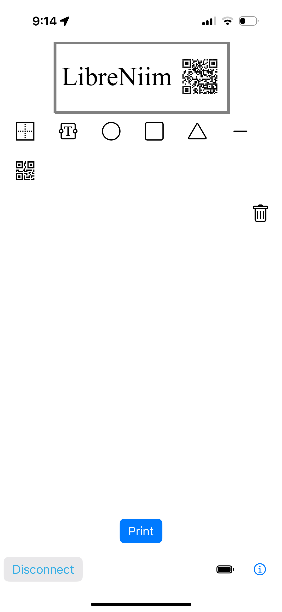

## LibreNiim

Open-source, end user, privacy focused printing app(s) for [Niimbot](https://www.niimbot.net) label printers.

### Where to download?
[TestFlight for macOS/iPad/iPhone](https://testflight.apple.com/join/UDG3UREI)

### Android / Windows / Linux?

Originally I've started making a web based editor to be used with some ble printing web stack.
But there's already a project by someone named MultiMote you should check - https://github.com/MultiMote/niimblue
NiimBlue above should work on Chrome based browsers, including Android.

It all started when I bought a D110 just to discover the appstore apps (iOS and Android) got in-app purchase built-into them which already got me wondering.
Then when trying to install it an old Android phone with custom rom, it complained it is rooted and didn't agree to run...

At this point, I've looked for open-source alternatives.

I was happy to discover some projects.
As other projects, this is mostly a port of [kjy00302/niimprint](https://github.com/kjy00302/niimprint) and [AndBondStyle/niimprint](https://github.com/AndBondStyle/niimprint).

Other notable projects:
https://github.com/ayufan/niimprint-web
https://github.com/dtgreene/niimbotjs/tree/main

Based on the APIs shown by those projects I've did some Swift port bundled in a simple label app. It uses [AsyncBluetooth](https://github.com/manolofdez/AsyncBluetooth) to abstract CoreBluetooth.

## Apps

Currently there is a Catalyst/SwiftUI app that can run on iOS, iPadOS and macOS.
[Apple Downloads on TestFlight](https://testflight.apple.com/join/UDG3UREI)

### Requirements:
- Intel or Apple silicon, macOS 12.1, Monterey or greater.
- iOS 15.2 or greater
- Bluetooth (no Printer USB connectivity)

I didn't test it on anything but the D110 I have.
So feedback and PRs are appreciated.

Once it feels mature enough, I'll try to publish it on the AppStore.

[Privacy](PRIVACY.md)
